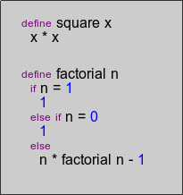

# Snakelisp

The snakelisp is a lisp dialect by Henri Tuhola. It is a study language to explore binary list processing.

Code sample:

 

Binary list processing uses "binary lists" instead of plain text files to store source code and data. The lists are read and modified with structure editors, such as [lisp-editor](https://www.youtube.com/watch?v=-AZbteER_Ho).

Goal of this project is to produce a professional programming tool. If you're looking for an educational tool you can use right now, you could look for projects such as [scratch](http://scratch.mit.edu/) or [blockly](https://blockly-demo.appspot.com/static/apps/index.html) instead.

## Motivation

Every source code listing is parsed into AST before they are interpreted. This justifies studies about direct manipulation and storage of those structures.

The author expects such environment to be more powerful than lisp, and more readable than python. Without readability issues, list processing environments are easier to understand and work with, provide better understanding about the programs written in them. It may make it faster to develop new programs. This project provides information about whether he is correct, or incorrect.

None of the text based tools work with binary lists. They need their own tools, that would have to be designed. This is a deterrent to adoption, but not a flaw. Binary lists require their own tools for manipulation.

## Danger on file format wars

On plain text files we've got utf-8, utf-16, ascii. Also we've got different carriage flag encodings: `0A`, `0A0D`, etc.

It is inevitable that on projects such as this, we might end up having several formats for "binary lists". Any such fragmentation on file formats would be a hindrance.

To alleviate the problem, I store the data structures in `.json` -format. Aside that I have binary stream format named `.blip`, which is using utf-8 encoding on strings. This format is unreadable and cannot be modified without an editor. I'm willing to consider for alternative formats and improvements into the specification, but keep in mind this format doesn't restrict transfer over plain text. There are various encodings for doing that. One just needs to choose one.

I've already considered `.bson`, but there are javascript-specific data types and labels included in the specification. These properties and bloat does not belong to homoiconic file format, it makes `.bson` unfit for generic purpose structured data.

There are other interesting data transfer formats such as [s-expressions](http://people.csail.mit.edu/rivest/sexp.html) and [bernstein netstrings](http://tools.ietf.org/html/draft-bernstein-netstrings-02). Variation of these might be more convenient than the `.blip` -format. Keep in mind though, that some text based tools would be still unusable. Incorrect parse needs to be corrected before it can be edited in a structure editor.

The `.blip` specification is work in progress. There's early alpha reference implementation in the `blip.py` for python.

Obligatory XKCD reference: how do you solve issues with existing and competing fileformats that partially overlap and generally do a poor job? Why you create a new file format, of course.

## Syntax

The language is using a variation of the list notation, common for lisp family of the languages. The B-expression may be a list, symbol, marker or a binary blob. Every B-expression may hold a label or an uid -string.

In the primary representation list is a box, which encloses it's elements, that appear in order: from left to right, from top to bottom. A "cr" -labeled marker may be interpreted as a line break, which can be filtered away before evaluating the form.

### Comments

Comments go to a separate layer -file, which matches with an uid -string in each element. The layer is broken into individual pieces that are laid aside the source file. The comment layer is optional.

The layer file's topmost list is labelled as `comments`. It consists of liss, each starting with an uid symbol/string. The body of that list is part of the comment.

### Numbers

Symbols beginning with a number, without a label will be interpreted as numbers.

    1234
    3x12012
    5.2

This notation is maintained, although it is not required for an implementation to implement this specific interpretation for symbols.

### Strings

Strings are symbols that have `string` -label. No escape character notation is required. The visual attempts to represent unprintable characters.

## Lexical scope

The snakelisp is lexically scoped. Every function defines a boundary. Inside the boundary one is free to bind new values with `let` -list. Variables in higher scope can be set with `set` -labelled list.

## Functions

Functions are formed with `func` -label. The first expression inside the label must be an argument list. Remaining expressions are interpreted as the body of the function. If there's no specific label, they are function calls.

When a function is called, the arguments are passed by value and bound to the scope using the argument list. Along the arguments a continuation is passed along, which represents remaining computation. The control flow returns to the continuation when evaluator finishes evaluating body of the function.

## Infix

Lists labeled with `infix` have their second element swapped with the first element. They are otherwise interpreted as calls.

## Control flow constructs

Lists labeled `cond` are conditional constructs. It is an array of lists. Each list has a condition in the head. If the condition evaluates true, the remaining of the list is evaluated. Only one list is evaluated completely. The last element may be `else` -labeled, meaning it will be evaluated if earlier conditions do not evaluate `cond`.

Lists labeled `while` contain condition in the head. If that condition evaluates true, the remaining of the list is evaluated, then `while` tries to evaluate again.

## Continuation passing as evaluation strategy

The snakelisp is compiling itself into continuation passing style as the intermediary form. The current compilation strategy follows the Cheney on the M.T.A. -paper. It is not suitable for interactive evaluation, so it will be supplied with an interpreter later on.
